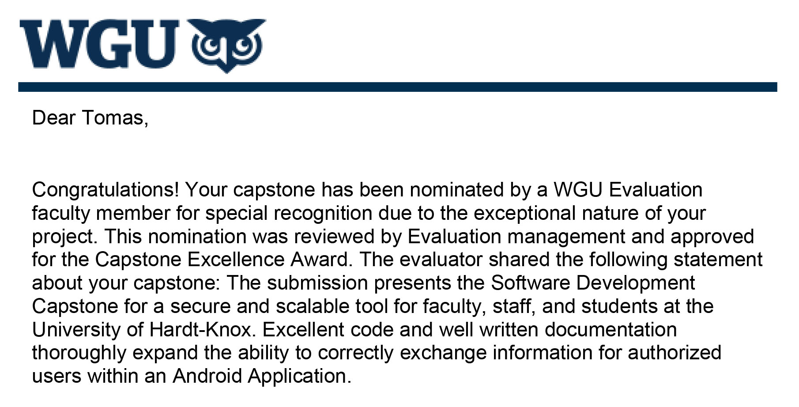

# Capstone Mobile Frontend
An Android mobile frontend for the WGU Capstone final student project. Communicates with a remote
backend via a RESTful API. Allow students to communicate easily with faculty, schedule appointments,
and monitor their academic progress.

### Awarded for Excellence
